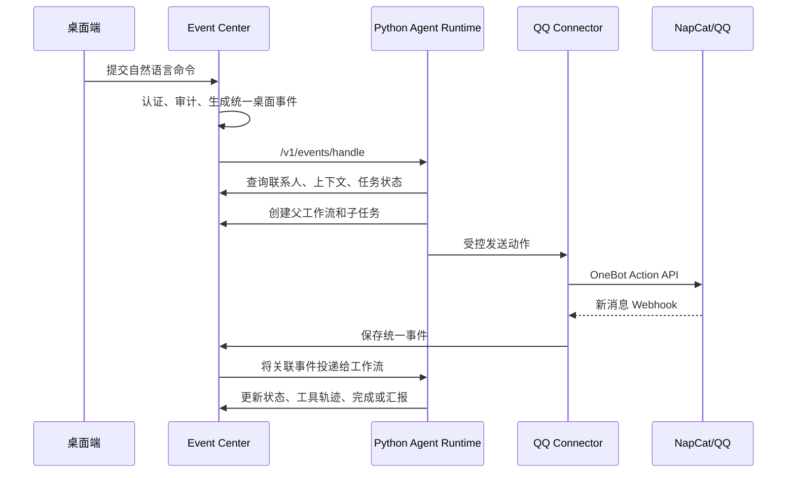

# Java 微服务架构与工程化说明

> 适用范围：`services-java`。本文区分已实现、重构中和规划目标，避免把设计愿景误写成已经稳定可用的能力。

## 1. 定位

Java 部分是 Memo Echo 的**平台接入层、状态与权限中枢、受控工具后端**。它不负责生成自然语言回复，而是负责把 QQ/NapCat 的事件、桌面端的命令和 Python Agent 的行动串成可审计、可恢复的业务流程。

核心职责：

1. 接收并标准化外部平台事件。
2. 保存会话、任务、审批、日程、消息摘要和执行轨迹。
3. 对 Python Agent 暴露受控的内部 API，而不是让模型直接访问数据库或第三方平台。
4. 为桌面端提供登录、模型配置、消息空间、会话设定、任务和通知接口。

## 2. 服务划分

| 服务 | 默认端口 | 已承担职责 |
| --- | ---: | --- |
| `qq-napcat-connector` | 8091 | OneBot/NapCat Webhook 接收、好友/群列表读取、私聊/群聊消息发送、消息段转换、QQ 登录状态读取 |
| `event-center-service` | 8093 | 统一事件存储、会话设定、桌面命令、委托工作流、审批/草稿、上下文与记忆读写、桌面端聚合接口 |
| `schedule-service` | 8092 | 日程读写、近期日程展示、手工新增和删除的服务边界 |
| `task-service` | 8094 | 普通任务领域服务；与 Agent 委托任务保持边界，避免把所有状态耦合到一个服务 |

当前版本以本地单机联调为主，服务之间使用 HTTP。未来可把事件流和耗时任务迁移到消息队列，但不能先为了“微服务”而引入分布式复杂度。

## 3. QQ/NapCat Connector

### 3.1 入站消息

NapCat 通过 HTTP Webhook 向 Connector 推送 OneBot 风格事件。Connector 负责：

- 校验入站 Token；
- 解析私聊、群聊、`@`、回复、图片、文件等消息段；
- 标记平台、会话类型、会话 ID、发送人、消息 ID、事件时间；
- 识别机器人自身发送的消息，防止回声触发；
- 把数据映射为统一事件，再转发到 Event Center 或 Agent Runtime。

### 3.2 出站动作

Python Agent 不能直接调用 NapCat。它调用 Event Center/Connector 的内部接口，Connector 再调用 NapCat 的动作 API，例如：

- `get_friend_list`、`get_group_list`：同步可选择联系人；
- `send_private_msg`、`send_group_msg`：发送文本或消息段；
- `get_login_info`：读取当前登录账号；
- 图片、文件等附件动作：在权限和能力齐备后异步处理。

这种间接调用的价值是：Java 能记录动作、做幂等判断、检查权限，并且可以在不改 Agent Prompt 的情况下替换平台实现。

## 4. Event Center：系统状态中枢

Event Center 维护以下核心实体：

| 实体 | 作用 |
| --- | --- |
| `UnifiedEvent` | 所有平台消息和桌面命令的统一事件模型 |
| Conversation Profile | 某会话的人格、权限、记忆和审批策略 |
| Delegated Workflow / Task | 主控台命令产生的父工作流与子任务图 |
| Conversation Message | 按时间线保存的对话消息，区分我方、对方、Agent 代发 |
| Draft / Approval | 需要人工接管或候选回复时的审查结果 |
| Digest Batch | 慢通道汇总后的消息摘要 |
| Schedule Item | 从聊天中提取或手动录入的日程 |
| Execution Trace | Agent 路由、工具调用、状态迁移和失败原因 |

### 4.1 统一事件的关键字段

```text
eventId / sourceMessageId / platform / accountId
chatType / chatId / senderId / senderName
occurredAt / receivedAt / payload / segments
senderRole(self|counterparty|agent|system)
origin(platform|agent_tool|desktop_command|history_import)
workflowId / taskId / correlationId
```

`senderRole` 和 `origin` 是后续上下文可信度、个人 Skill 训练、去重和审计的基础。只有来源明确的我方真实手工消息才能进入个人风格训练候选集。

## 5. 主控台闭环



命令本身不是聊天上下文。它是 `desktop_command` 来源的控制事件，供 Router 解析；实际聊天上下文只由同一会话的聊天消息构成。

## 6. 数据库与迁移

当前本地环境使用 MySQL，端口通常为 3306。每个服务使用独立 schema，例如 Event Center、Schedule、Task。数据库结构由 Flyway 管理：

1. 服务启动时校验 `flyway_schema_history`。
2. 未执行迁移按版本顺序执行。
3. 业务代码不应依赖手工建表。
4. 新字段必须新增迁移，不修改已上线迁移文件。

推荐约束：业务主键使用 UUID；外部消息 ID 与平台、账号、会话联合唯一；事件写入前做去重；跨服务操作以 Saga/补偿方式处理，不使用跨库事务。

## 7. 工程化约束

### 幂等和顺序

- Webhook 可重复投递，必须以平台消息 ID、事件 ID 或动作幂等键去重。
- 对话展示按 `occurredAt` 排序，接收时间只能作为兜底。
- Agent 发送消息后必须写回同一会话时间线，并标记 `agent_tool`，否则下一次推理会误判“消息没有发送过”。

### 安全与权限

- NapCat Token、模型 API Key、资产密钥均不得明文回传桌面端。
- 对外 Webhook 与内部管理接口分开鉴权。
- 高风险工具由 Java 服务再次检查权限，不能只依赖 Prompt。
- 收款码、卡密、文件交付等资产使用加密存储和显式授权。

### 可观测性

每次链路应贯穿 `correlationId`、`workflowId`、`taskId` 和 `eventId`。日志至少记录：入站事件、路由结果、工具调用请求/结果、状态迁移、审批决定、异常堆栈。桌面端展示的是脱敏后的执行轨迹，不应直接展示模型隐式推理。

## 8. 现状与下一步

已具备的基础是本地多服务、NapCat Connector、Event Center 持久化、Flyway、桌面端 API 和 Agent 调用入口。仍在重构中的重点是：父子工作流的一致状态、任务上下文窗口、动作幂等、联系人同步失败后的可见诊断，以及将旧的直连/规则分支收敛为统一工具网关。

