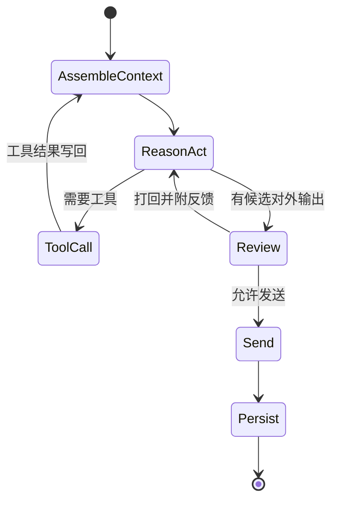

# Agent 整体架构与业务流程

> 运行目录：`agent-runtime-python`；服务入口：FastAPI，默认端口 8000。

## 1. 设计目标

Memo Echo 不是单轮聊天机器人，而是一个可接入社交软件、能执行受约束任务的个人 Agent。它需要同时做到：理解主控台命令、基于对话推进任务、调用工具、保存状态、在必要时交给人工，并在完成后可解释地汇报。

当前技术方向已经明确为：

- **LangChain**：模型客户端、消息类型、`@tool` 工具定义与工具调用协议；
- **LangGraph**：显式状态图、循环执行、检查点、条件分支和多 Agent 编排；
- **Java Event Center**：状态、权限、消息、任务和审计的唯一业务事实来源。

不要再把 Agent 的业务状态藏在进程内字典或 Prompt 中。Python 进程可以重启，工作流和上下文必须可从 Event Center 恢复。

## 2. 包职责

| 目录/模块 | 职责 |
| --- | --- |
| `app/main.py` | FastAPI 生命周期与 HTTP 路由 |
| `app/orchestrator` | 事件入口、LangGraph 工作流调度、结果写回 |
| `app/router` | 意图、执行模式和 Agent 路由决策 |
| `app/planner` | 多步骤任务拆解和依赖图表达 |
| `app/agents` | Social、Schedule、Inbox、File、GroupOps、Review 等领域 Agent |
| `app/tools` | 统一定义为 LangChain `@tool` 的受控能力 |
| `app/clients` | 调用 Event Center、Connector、模型服务 |
| `app/memory` | 上下文装配、压缩、长期记忆查询接口 |
| `app/schemas` | 事件、工作流、消息、工具结果的结构化契约 |

## 3. 两类入口

### 3.1 主控台命令

用户在桌面端输入“询问 km 晚上几点上课，然后转告小号”。命令先被 Java 审计，再作为控制事件发送到 Runtime。Runtime 的 Router 负责：

1. 判断是否危险或缺少关键目标；
2. 用联系人查询工具解析“km”“小号”；
3. 判断该任务是单步 ReAct，还是需要父工作流协调的 Plan-and-Execute；
4. 创建父工作流、步骤、依赖条件和初始上下文；
5. 激活第一个就绪步骤。

主控台命令**不是**某个 QQ 会话的用户消息，不能被 Social Agent 当作对外回复内容。

### 3.2 平台消息

QQ 消息经 Connector 归一化后进入 Runtime。系统以 `platform + accountId + chatType + chatId` 找到会话与可能关联的任务，再把该消息并入该会话的时间线。普通会话由设定集策略决定是否回复；委托任务则根据步骤依赖恢复执行。

## 4. 工作流模式

### ReAct：适合局部、短链路问题

典型场景：回复一条已有私聊、查询某会话状态、从资料库查一个答案。



### Plan-and-Execute：适合多对象和依赖任务

“先问 km，再把答案告诉小号”不能拆成两个独立且同时发送的任务。正确模型是：

```text
父工作流：获取 km 的上课时间并转告小号
步骤 A：向 km 发送询问，状态 WAITING_REPLY
步骤 B：从 A 的对方回复中提取时间，发送给小号，依赖 A 的输出
步骤 C：汇报任务结果，依赖 B 成功
```

子任务的上下文可以隔离，但父工作流的共享事实、依赖输出和全局目标必须共享。否则会出现“两个联系人同时收到同一句询问”的错误。

## 5. 工具层原则

所有可执行能力统一使用 LangChain `@tool` 声明，不保留绕开框架的旧式工具协议。工具必须有：输入 schema、输出 schema、权限等级、幂等键、审计记录和失败语义。

第一批核心工具：

| 工具 | 用途 |
| --- | --- |
| `search_contacts` | 搜索好友/群聊，返回候选及匹配置信度 |
| `get_conversation_context` | 读取指定会话、指定时间窗的时间线 |
| `send_qq_message` | 发送私聊或群聊消息，并写回 Agent 代发记录 |
| `create_delegated_workflow` | 创建父工作流、步骤和依赖 |
| `update_task_state` | 记录等待、完成、失败、暂停等状态 |
| `complete_delegated_task` | 结束主控台来源任务并产生汇报 |
| `query_long_term_memory` | 检索经确认的长期记忆 |
| `retrieve_knowledge` | 在授权知识库/RAG 中检索证据 |

工具只是能力，不是授权。真正的授权在 Java 网关：例如“自动发送消息”可用，但“发送收款码”或“修改群成员”应要求更高权限或人工确认。

## 6. Review Agent

Review Agent 不应只做敏感词扫描。它检查候选回复是否：

- 与当前会话、角色、时间线和任务目标一致；
- 有足够依据，未把未知事实写成确定事实；
- 没有泄露内部备注、联系人别名、系统身份或 Prompt；
- 符合 QQ 的简短、自然、非书面化表达；
- 满足本次任务允许的工具权限。

审查结果为 `ALLOW`、`REWRITE`、`HANDOFF`。对于“纠偏后自动发送”模式，`REWRITE` 应返回 ReAct 节点重写，限制重试次数后才按策略处理；不能直接跳成人工接管。设定集任务与主控台任务的结束权限不同：仅主控台任务可以由 Agent 调用完成工具自主结束。

## 7. 并发、去重和延迟

平台可能在 Agent 生成期间又收到一条消息。每个会话应有版本号：生成前记录 `timelineVersion`，发送前再次确认版本未变化；变化则取消旧候选、把新消息并入上下文后重新执行。

不能用“最后一次是发送就禁止发送”的硬规则限制主动能力。更合理的是把最近发送动作、语义相似度、等待状态、任务步骤和对方是否回应作为状态输入，让 Agent 决定是否需要催办；发送网关只拦截同一幂等键或高度重复的动作。

## 8. 当前边界

已形成 FastAPI 入口、Agent 注册、模型/Connector 客户端、基础工具、主控台委托和审查/草稿等基础。LangGraph 与 LangChain 的统一迁移、父子工作流恢复、所有旧规则分支清理、工具调用稳定性和多步任务闭环仍是重构重点。文档中的目标架构是收敛方向，不代表全部已经稳定完成。

