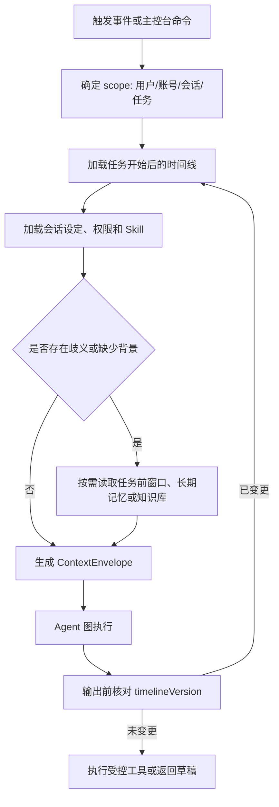

# Agent 上下文框架设计

## 1. 文档目的与当前状态

本文定义 Memo Echo 在处理一条社交消息或一个主控台委托任务时，Agent 应当看见什么、哪些内容不能混入、如何按时间组织，以及如何在并发消息到达时避免重复回复。

这是目标架构与当前重构方向。仓库已经具备统一事件、会话配置、委托工作流、消息持久化等基础，但“上下文装配器、工作流状态、消息事件消费”仍处于持续收敛阶段。文档中的接口边界可作为后续实现和面试说明的统一依据，不能理解为所有细节均已稳定上线。

## 2. 核心原则

1. 上下文不是一段拼接的 Prompt，而是带来源、时间、作用域和版本号的数据包。
2. 每个会话、每个任务、每个工作流有独立上下文，不能把 A 私聊的内容泄漏到 B 私聊。
3. 主控台命令是“控制指令”，不是 QQ 聊天消息，绝不能作为对方可见对话的一部分。
4. 任何模型结论都必须能回溯到消息、用户设定、Skill、知识库或工具返回值。
5. 发送前与生成时使用同一份上下文快照；如果期间来了新消息，旧决策必须失效并重新计算。

## 3. ContextEnvelope：统一上下文信封

建议由 Java Event Center 提供事实数据，由 Python Agent Runtime 组装为如下逻辑结构：

```text
ContextEnvelope
├── execution：一次 Agent 执行的 executionId、触发事件、当前时间
├── scope：userId、platform、accountId、chatType、chatId
├── identity：账号本人、对方公开昵称、会话安全称呼
├── workflow：workflowId、parentWorkflowId、taskId、stepId、任务开始时间
├── timeline：按时间排序的消息与工具动作
├── taskState：目标、步骤、已确认事实、待确认条件、状态版本
├── profile：会话设定、业务规则、Skill、可用工具、审批策略
├── memory：检索到的长期记忆及其证据
├── knowledge：RAG 检索片段及其来源
└── guardrails：权限、风险等级、输出规范、上下文版本号
```

`ContextEnvelope` 是给 Router、Planner、ReAct Executor、Review Agent 和 Tool Executor 共用的输入契约。不同节点可按需要读取不同字段，但不得自行拼入未声明来源的文本。

## 4. 时间线消息模型

每条消息或动作需要落为可审计的事件，至少保存：

| 字段 | 含义 |
| --- | --- |
| `eventId` / `messageId` | 幂等去重与证据定位 |
| `occurredAt` | 平台原始发生时间，用于理解“今天、明天、刚才” |
| `receivedAt` | 服务收到事件的时间，用于排障 |
| `senderRole` | `SELF`、`COUNTERPARTY`、`AGENT`、`SYSTEM` |
| `origin` | `platform_event`、`agent_tool`、`desktop_command`、`history_import` |
| `platform/chatType/chatId` | 会话边界 |
| `content/segments` | 文本、图片、文件、引用等标准化内容 |
| `taskId/workflowId` | 归属任务；普通聊天可为空 |
| `sourceTrust` | 平台原始、用户确认、历史导入、模型推断等 |

### 4.1 身份与称呼分离

联系人内部可使用备注或稳定 ID，例如 `contactId=3807050597`；发送给对方时只能使用该会话对方已知的称呼。`km` 这类本地备注可以帮助查找联系人，但不能作为模型对外输出的默认素材。上下文中应同时保存：

```text
internalAlias: km                 # 仅内部检索
displayName: 小明                 # 客户端展示
safeAddressing: 你 / 小明同学      # 可对外使用，缺失时优先“你”
```

### 4.2 主控台命令隔离

例如“先问 km 今晚几点上课，再转告小号”只属于 `desktop_command`。它用于生成父工作流和步骤，不能被 Social Agent 当作“我已经对 km 说过的话”，也不能被 Review Agent 当成聊天事实。

## 5. 分层上下文装配

### L0：当前触发

包含新消息、执行时间、触发来源、当前权限和 `timelineVersion`。这是每次运行必需的最小输入。

### L1：任务窗口原始时间线

对于主控台委托任务，默认读取 `taskStartedAt` 之后同一会话的全部相关事件，包含本人手动消息、Agent 代发消息和对方消息。必须显式标注发送者与时间，例如：

```text
[2026-08-20 19:03:11] 我方（Agent 代发）：今晚七点有课吗
[2026-08-20 19:05:02] 对方：七点半
[2026-08-20 19:05:08] 系统：等待把答案转告给小号
```

这层解决“Agent 忘记自己已经发送过什么”“收到回复后不知道是在回答哪条问题”的问题。

### L2：任务前背景窗口

任务开始前的消息不默认无限加载。Agent 在有歧义时可调用“获取任务前上下文”工具，按 `taskStartedAt` 向前裁剪 N 条或一个时间窗口，并严格限制到当前会话。时间敏感任务要携带绝对日期，避免跨天后把“明晚”误解为“今晚”。

### L3：会话摘要与认知卡

长期对话不能每次把全部原文塞给模型。应维护：

- `rollingSummary`：最近阶段发生了什么、未决问题、已达成共识。
- `conversationCard`：关系、称呼、沟通偏好、已确认事实、敏感边界。
- `taskDigest`：任务目标、已完成步骤、输出物、下一步、失败原因。

摘要是压缩索引，不是原始事实的替代；高风险判断应回查 L1/L2 中可定位的原始消息。

### L4：长期记忆与外部知识

只按需检索。长期记忆解决“这个人是谁、用户的长期偏好是什么”；RAG 解决“文档或知识库里有什么”。两者必须带证据和置信度，详见记忆与 RAG 文档。

## 6. 上下文装配流程



## 7. 并发、乱序与重复消息

### 7.1 版本化重算

每个会话维护单调递增的 `timelineVersion`。生成回复前记录版本；调用模型和审查完成后，若版本不一致，说明期间有新事件进入：旧候选回复不能发送，应基于最新时间线重新规划。

### 7.2 事件幂等与顺序

- 用平台 `messageId` 或可重建指纹做入站去重。
- 按 `occurredAt` 排序，`receivedAt` 仅用于处理延迟诊断。
- Agent 发送动作要先记录 `pending`，平台成功后写入 `sent` 事件，失败则可重试但必须携带幂等键。
- 同一会话同一时刻只允许一个执行租约，避免两个 worker 同时对相同消息作答。

### 7.3 语义重复控制

不要只依赖“最后一次是发送消息就禁止再发”的硬规则。应由任务状态、未答问题、发送历史、间隔时间和语义相似度共同决定：可以主动提醒，但不能在没有新信息时连续发送同义邀请或催促。

## 8. 父工作流与子任务上下文

复杂命令应由父工作流统一管理，例如：

```text
父工作流：询问 km 晚上几点上课，收到回复后转告小号
步骤 A：向 km 询问上课时间
步骤 B：等待 A 产出“已确认上课时间”
步骤 C：将 A 的事实发给小号
```

子步骤之间的聊天时间线应隔离，不能让“问 km”的问题发给小号；但步骤 A 的**确认输出物**必须作为结构化事实写入父工作流，再注入步骤 C。这样既保留会话隔离，又解决跨会话协作。

## 9. 上下文压缩策略

上下文压缩有必要，但不能过早。建议策略：

1. 最近 20 至 50 条原始消息直接保留。
2. 更早内容用滚动摘要替代，摘要保存来源事件 ID。
3. 对正在执行的任务，始终保留任务起点、所有 Agent 动作、所有对方回复和未决条件。
4. 当 token 预算不足时，优先删除低价值闲聊，而非删除时间、承诺、价格、地址、任务状态等关键事实。
5. 需要精确判断时允许工具回查原文，而不是让模型凭摘要臆测。

## 10. 给 Review Agent 的输入

Review Agent 不应只收到候选文本。它至少需要：候选回复、当前会话时间线、任务目标、可引用事实、会话设定、工具动作计划、审批模式和上下文版本。审查问题包括：

- 这句话是否与当前对话对象和时间一致？
- 是否把内部备注、系统字段、桌面命令泄露给对方？
- 是否声明了上下文里不存在的事实？
- 是否忽略了任务完成、等待、依赖步骤等状态？
- 是否需要调用工具而非发送文本？

## 11. 实施优先级

1. 固化统一事件字段和 `senderRole/origin`，先修复上下文双方身份混乱。
2. 建立按 `workflowId/taskId/chatId` 查询的任务窗口与 `timelineVersion`。
3. 落实父工作流输出物与子步骤依赖，取消“多个独立任务互相猜进展”的逻辑。
4. 用滚动摘要、认知卡和按需回查替代无限拼接 Prompt。
5. 最后接入长期记忆和 RAG，并要求所有检索结果保留来源。

