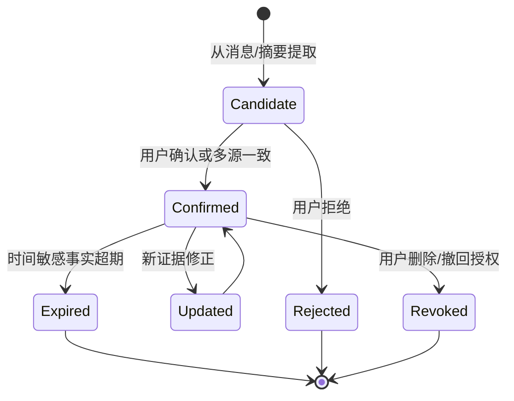

# 记忆系统与个人化设计

## 1. 目标与边界

Memo Echo 的“记忆”不是把所有聊天记录永久塞进 Prompt，也不是直接训练一个模仿用户的模型。它的目标是：在用户授权的前提下，持续积累可信的长期信息，使 Agent 能更好地理解关系、偏好、任务状态和表达习惯，同时允许用户查看、更正、删除和关闭。

当前项目已经具备会话历史、摘要、会话配置和部分长期记忆相关的数据与接口基础；更完整的记忆生命周期、个人 Skill 提炼和检索治理属于正在收敛的架构能力。本文区分目标设计与已有基础，避免将其表述为已完全自动化的功能。

## 2. 记忆、上下文与 RAG 的区别

| 概念 | 解决的问题 | 典型内容 |
| --- | --- | --- |
| 短期上下文 | 当前这轮对话发生了什么 | 最近消息、任务步骤、未决问题 |
| 长期记忆 | 未来仍可能成立的个人事实与偏好 | 常用称呼、沟通习惯、已确认关系 |
| RAG 知识库 | 外部文档或资料里有什么 | 课程通知、项目文档、商品说明 |
| 个人 Skill | 如何表达和处理某类场景 | 短句习惯、礼貌程度、场景策略 |

长期记忆必须可以被证据支撑；RAG 文档即使被检索到，也不能自动升级为“用户本人事实”。

## 3. 分层记忆模型

### M0：执行状态

作用域是单次 Agent 执行或一个工作流。记录当前图节点、工具调用、重试次数、上下文版本、待发草稿和审批状态。它用于恢复和排障，不应作为长期人格材料。

### M1：会话工作记忆

作用域是单个 `platform + account + chatType + chatId`。包含滚动摘要、会话认知卡、未完成承诺、最近任务和关键事实索引。它支持持续聊天，但可按保留策略过期或压缩。

### M2：结构化长期记忆

作用域可以是用户、账号、联系人、群聊或主题。适合保存稳定或经用户确认的信息，例如：

- 用户偏好：喜欢简短回复、是否愿意使用表情、常用称呼。
- 联系人关系：同学、老师、买家、项目成员及可信度。
- 事实与约束：已确认的上课时间、最低报价、禁止透露的信息。
- 习惯：某位联系人更偏好晚间沟通、只接受正式称呼。
- 任务结果：某个工作流已结束、已通知哪些对象。

### M3：个人化表达 Skill

从用户明确授权的本人消息中提炼“可配置风格”，而不是把原文机械复制。Skill 按场景分组，例如熟人私聊、老师沟通、群聊、交易沟通、项目协作。每份 Skill 都应可预览、可编辑、可禁用。

## 4. MemoryRecord 数据契约

建议每条长期记忆具备如下字段：

```text
memoryId, userId, scopeType, scopeId,
category, key, value, summary,
confidence, status, sensitivity,
sourceEventIds, sourceType, sourceRole,
createdAt, updatedAt, expiresAt, lastAccessedAt,
approvedByUser, revision, embeddingReference
```

其中：

- `scopeType`：`USER`、`ACCOUNT`、`CONTACT`、`GROUP`、`CONVERSATION`、`WORKFLOW`。
- `category`：事实、偏好、关系、沟通风格、任务结果、风险提示等。
- `confidence`：不是模型自信程度，而是证据和确认程度的综合评分。
- `status`：候选、已确认、过期、被撤回、已删除。
- `sensitivity`：普通、私密、敏感；控制是否能进入某类 Agent 和日志。
- `sourceEventIds`：必须保留来源，支持用户追溯“为什么记住这件事”。

## 5. 生命周期：从候选到可用



提取到的候选记忆不应立即成为强事实。高风险信息、身份信息、支付信息和私人关系必须要求用户确认，或至少保留低置信度并限制自动使用。

## 6. 何时查询长期记忆

长期记忆不应该在每次消息都全量注入。建议由 Agent 通过工具或策略按需查询：

1. **初始化会话上下文时**：加载当前联系人或群聊的高置信度认知卡。
2. **出现歧义时**：如“还是老地方”“按之前的价格”，检索与当前联系人、任务相关的事实。
3. **创建或执行任务时**：检索已完成任务、沟通偏好、业务约束，避免重复执行。
4. **生成回复前**：仅在回复需要引用长期事实时检索，防止无关记忆污染语气。
5. **Review Agent 审查时**：候选回复如果声称某个私人事实，审查器要求提供记忆或原始消息证据。
6. **用户明确询问时**：如“你记得我和谁约过课吗”“忘掉我的某项偏好”。

检索返回的内容必须包含置信度、作用域和来源，而不是只返回一句裸文本。

## 7. 何时更新长期记忆

推荐采用“事件触发 + 低频合并”而不是每条消息都写库：

- 会话摘要生成后，提取可能长期有效的候选事实。
- 工作流结束后，写入任务结果、最终时间、通知对象等结构化结果。
- 用户手动保存、编辑、删除时立即更新。
- 新消息与旧事实冲突时生成“待确认修正”，不要静默覆盖。
- 定期任务清理过期日程、临时地址、一次性约定等时间敏感内容。

“最近正在聊什么”属于 M1，不应误写成永久记忆；“用户惯常喜欢短句”需要大量样本和确认，才可能进入 M3。

## 8. 个人 Skill 的可信提炼

### 8.1 数据准入

只有用户本人实际发送且在授权范围内的消息可作为训练样本。以下内容必须排除或单独标记：

- Agent 自动发送、草稿、失败重试、系统通知。
- 未获授权导入的历史记录。
- 对方消息、群内其他成员消息。
- 敏感信息、支付凭据、证件信息、未经确认的私人事实。

历史导入如果用户选择“假定为本人样本”，也必须在界面明确提示其风险，并在样本来源中保留该标记。

### 8.2 场景化，而非单一人格

同一个人在老师、朋友、群聊和交易沟通中的表达不同。个人 Skill 应按 `scene` 建模：

```text
friend_chat / teacher_chat / group_chat / project_chat / commerce_chat
```

每个场景可提炼句长区间、标点密度、称呼、回复速度、表情使用、拒绝方式、常见开场和收尾等统计特征，并保留用户可编辑的自然语言说明。

### 8.3 提炼流程

1. 收集满足数量、时间跨度、来源可信度要求的样本。
2. 清洗引用、转发、链接、重复消息和异常长文本。
3. 按场景聚类，抽取统计特征与代表性表达。
4. 生成“建议 Skill”，展示样本量、覆盖时段、场景和置信度。
5. 用户审批后才允许加载到会话设定。
6. 运行时将 Skill 作为风格约束，而非事实来源；它不得覆盖安全、权限和审查规则。

## 9. 隐私、删除和可解释性

记忆能力必须配套用户控制：

- 显示记忆条目、来源、作用域、更新时间和置信度。
- 支持编辑、撤回、删除、导出和关闭特定会话的学习。
- 删除源消息或撤销授权后，关联摘要、向量和 Skill 样本应进入级联清理队列。
- API Key、收款码、密码、验证码等资产不写入普通记忆文本；应进入加密资产或完全禁止存储。
- 日志中只记录 memoryId、类别和来源 ID，避免打印敏感 value。

## 10. 与任务和审查的关系

任务状态优先于记忆：如果工作流已经完成，旧记忆不能重新触发发送。记忆用于解释背景，任务状态用于决定是否执行。

Review Agent 在发现“候选回复声称了上下文没有的内容”时，应尝试查询当前作用域内的高置信度记忆；找不到可靠来源才转人工或要求重新规划，而不是盲目编造。

## 11. 建议的实施顺序

1. 先统一消息来源、发送者角色和工作流结果的持久化。
2. 落地 M1 会话摘要与任务认知卡，解决重复发送和上下文遗忘。
3. 落地带来源的 M2 结构化记忆及用户管理界面。
4. 为 M2 建立检索工具和审查证据链。
5. 最后基于授权样本建立 M3 场景化个人 Skill，并进行离线评估。

## 12. 面试表述

可以将该设计概括为：Memo Echo 将记忆拆分为工作流状态、会话工作记忆、可追溯长期记忆和场景化表达 Skill；采用来源追溯、置信度、作用域和用户审批控制，避免把模型摘要或自动代发消息误当作用户长期事实。

