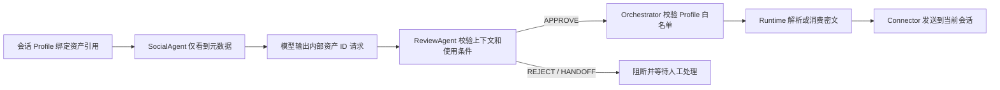

# 安全资产库

安全资产库用于保存“只有满足明确条件后才能发送”的内容，例如收款码、卡密、交付文本和文件地址。它解决的是受控交付问题，不是把敏感正文拼进人格提示词。

## 安全边界

- 桌面端只读取资产元数据，不会从查询接口取回正文。
- 正文在 `event-center-service` 中使用 AES-GCM 加密后落库。
- Python Runtime 和模型提示词只传递资产 ID、名称、类型及使用条件。
- 只有受信任 Runtime 可以调用解析接口，普通桌面 JWT 不能读取明文。
- SocialAgent 只能提出资产请求，ReviewAgent 必须独立审批，Orchestrator 还会再次校验当前 Profile 白名单。
- 日志、执行轨迹、Agent 结果和工具返回值都不得记录资产正文。
- 任一审批、授权、解析或发送步骤失败时采用 fail-closed：资产和普通成功承诺都不发送。

## 调用链路

内部控制标记为 `[[MEMO_ECHO_USE_ASSET:资产ID]]`。该标记只存在于 Agent 内部草稿处理中，会在平台回写前剥离，不能直接展示给聊天对象。

## 资产类型和正文格式

| 类型 | 推荐正文 | 当前发送方式 |
| --- | --- | --- |
| `PAYMENT_CODE` / `IMAGE` | `data:image/...;base64,...`、`base64://...`、HTTP(S) URL 或本地可访问路径 | OneBot 图片消息段 |
| `LICENSE_CODE` / `SECRET_TEXT` | 短纯文本 | QQ 文本消息 |
| `FILE` | HTTP(S) 下载地址 | 暂按文本链接发送 |
| `OTHER` | 纯文本 | QQ 文本消息 |

当前 Connector 尚未提供统一文件上传 API，因此 `FILE` 资产只支持远程地址。后续接入文件上传工具时应继续复用相同的审批和白名单机制，不能让模型直接访问本地任意路径。

## 使用策略

| 策略 | 行为 |
| --- | --- |
| `REUSABLE` | 可重复解析和发送，不保存剩余次数 |
| `SINGLE_USE` | 每次解析前原子扣减库存，竞争失败时不返回正文 |

编辑一次性资产时，如果请求没有提交 `remainingUses`，服务会保留数据库中的当前库存。只有用户明确修改剩余次数时才会覆盖。

## HTTP 契约

桌面管理接口：

- `GET /internal/secure-assets`
- `GET /internal/secure-assets/{assetId}`
- `POST /internal/secure-assets`
- `PUT /internal/secure-assets/{assetId}`
- `DELETE /internal/secure-assets/{assetId}`

这些接口的响应只有元数据和 `contentConfigured`，不包含正文或密文。

Runtime 解析接口：

- `POST /internal/secure-assets/{assetId}/resolve`
- 必须携带 `X-Memo-Echo-Runtime-Token`
- 必须携带 `X-Memo-Echo-User-Id`

## Profile 绑定原则

资产必须通过 Conversation Profile 2.0 的 `profileContext.assets` 显式绑定。每条引用至少包含：

- `assetId`：安全资产 ID
- `usageCondition`：何时允许发送，例如“对方确认购买且付款状态已由用户或可信工具确认”

条件为空、语义不清、付款或交付状态不确定时，ReviewAgent 应转人工接管，而不是让模型自行推断。

## 后续增强

- 为文件资产增加受控上传和大小、MIME、病毒扫描限制。
- 增加资产发送审计表，仅记录资产 ID、会话、审批结果和时间。
- 引入交付幂等键，避免网络重试造成重复发送或重复消费。
- 为高风险资产增加强制人工审批策略和短期授权令牌。
