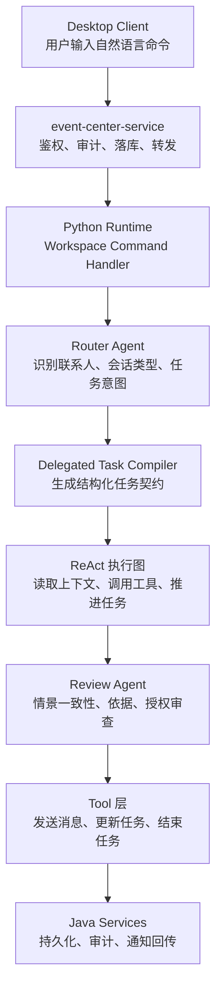

# 主控台自然语言命令链路

## 当前结论

主控台命令的目标是让用户直接用自然语言委托事务，例如：

- `帮我问一下 km 今晚有没有空打游戏`
- `通知一下 km 和小号，今天晚上七点有课`
- `帮我和张老师约一下明天下午的课程时间`

当前设计不是“前端解析命令”，也不是“Java 用关键词直接创建任务”。主控台命令先进入 Java 侧做鉴权、审计和可靠转发，然后进入 Python Agent Runtime，由 Router Agent 识别目标、任务类型和执行模式，最后由 Delegated Task Workflow 创建并执行任务。

## 整体链路

## Java 侧职责

`event-center-service` 负责可靠边界，不负责理解业务目标。

- 校验本地登录用户和请求权限
- 做基础风险审计，例如危险操作、越权工具、缺少用户授权
- 保存主控台命令、任务状态、执行进度和审计记录
- 把命令转发给 Python Runtime
- 接收 Runtime 的结构化结果并更新前端可见状态

Java 侧可以做安全兜底，但不应该用正则把 `km`、`小号`、`明天` 这类片段直接拼成任务。否则容易导致联系人误选、群聊私聊混淆、任务标题截断和多联系人失败。

## Python Runtime 职责

Python Runtime 是智能编排中心。

- Router Agent 读取命令和可用联系人列表，选择目标会话
- Router Agent 判断任务应该使用普通 ReAct、持续委托任务，还是后续更复杂的 Plan-and-Execute
- Delegated Task Workflow 把自然语言命令编译为任务契约
- 执行图通过工具读取历史消息、发送消息、更新进度、结束任务
- 审查 Agent 判断候选回复是否符合情景、记忆和授权

如果命令里出现多个联系人，Router Agent 会返回多个目标，Runtime 会拆成多个任务实例，而不是把多个联系人混成一个群聊。

## 联系人选择规则

联系人选择由 Router Agent 完成，输入是 Java 或 Connector 同步过来的联系人候选列表。

- 私聊默认优先，除非用户明确说“群聊、群里、这个群”
- 只有显式出现群聊语义时才允许选择群会话
- 如果联系人名称不唯一，Runtime 应该返回澄清状态，而不是猜测
- 如果联系人不存在，Runtime 应该要求用户选择或先同步联系人

## 工具边界

Agent 不能直接操作 QQ、数据库或文件系统。外部副作用必须走工具层。

当前主控台链路重点工具包括：

- `list_contacts`：读取可用好友和群聊
- `get_conversation_history`：读取带时间戳的上下文
- `send_qq_message`：向指定私聊或群聊发送消息
- `update_delegated_task`：写入任务进度
- `finish_delegated_task`：任务完成后结束任务
- `request_human_review`：需要用户确认时暂停自动代理

工具调用需要被审计和落库，方便前端显示“Agent 做了什么、为什么这么做”。

## 审查策略

审查不是简单拦截敏感词，而是判断候选回复是否有足够依据。

- 是否与当前任务目标一致
- 是否符合历史上下文和对方最近表达
- 是否依赖了不存在的私人事实、联系方式、金额、账号、身份或承诺
- 是否容易暴露“非本人代发”
- 是否需要用户确认后才能继续

主控台创建的委托任务可以由 Agent 在满足完成条件后调用结束任务工具自动结束；会话设定集里的长期代理默认不允许自主结束。

## 当前限制

- 复杂任务仍以 ReAct 执行为主，Plan-and-Execute 和 Sub-Agent 编排还在规划中
- 联系人列表依赖 NapCat 同步结果，未同步时 Router Agent 只能要求用户澄清
- 审查 Agent 仍需要继续优化“情景合理性”和“聊天自然度”
- 多轮连续消息需要会话级队列合并，避免上一条还没处理完时就对过期上下文回复
